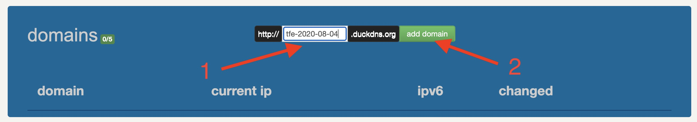
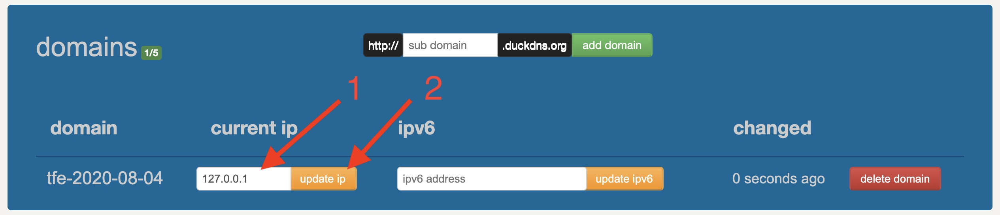

# vagrant-tfeV4-demo-self-signed

task: Install DEMO version of Terraform Enterprise (ex PTFE) v4 with Self Signed Certificate - Vagrant

note: The following instructions are true for v202007-2 of Terraform Enterprise. Adapt as needed for other versions.

Info: In order to have a valid SSL certificate, you would need a domain name.
As an example, I am going to use duckdns.org for a free subdomain and Letsencrypt for a free SSL certificate.

## Obtain a free subdomain from duckdns.org

1. Point your web browser to: https://www.duckdns.org/
2. Sign-in with any of the supported methods (GitHub, Twitter, Reddit, Google, etc.)
3. Make note of the token. You will need it later.
4. Create a new unique sub-domain (for example, tfe-2020-08-04)

5. Set the current IP to 127.0.0.1


## Usage

0. [Get a Terraform Enterprice license](https://www.hashicorp.com/request-demo/terraform/)
1. [Install Vagrant](https://www.vagrantup.com/docs/installation/)
2. Clone this repository and `cd` into it.

3. Run the following:

```
$ vagrant plugin install vagrant-disksize
$ TFE_FQDN=(your_own_domain_name_here) DUCKDNS_TOKEN=(your_token) vagrant up
(for example: $ TFE_FQDN=tfe-2020-08-04.duckdns.org DUCKDNS_TOKEN=123123 vagrant up)

* Open a web browser to http://localhost:8800/

* Continue the manual set-up according to the guide:
 - Hostname: Your FQDN (for example: tfe-2020-08-04.duckdns.org)
 - Click on "If your private key and cert are already on this server, click here."
 - Private Key Path = /cert/tfe.key
 - Certificate Path = /cert/tfe.cer
 - Click "Save & Continue"

*** - Select a license file
 - Choose an "Online" installation type and click "Continue"
 - Choose a password for the Admin Console and click "Continue"
 - Make sure all the pre-flight checks are green and click "Continue"
 - Hostname: localhost:8443
 - Installation type: Demo
 - Click "Save"
 - Click "Take me to the Dashboard"
 - Wait until the application finished loading (might need to refresh the Dashboard page, if it appears stuck)
 - Click on the "Open" link, that takes you to the TFE account creation page
 - Create the main TFE admin user

* (As TFE may fail to properly redirect) Open a web browser to https://localhost:8443/app

* Play around with your own TFE instance

When done, do a
$ vagrant destroy

(delete the domain in duckdns.org)
```

* [Installation instructions](https://www.terraform.io/docs/enterprise/install/index.html) / [Pre-flight checklist](https://www.terraform.io/docs/enterprise/before-installing/index.html) / [Refference architecture](https://www.terraform.io/docs/enterprise/before-installing/reference-architecture/index.html)


[Deployment method](https://www.terraform.io/docs/enterprise/before-installing/index.html#deployment-method-decision): Individual deployment

[Operational mode](https://www.terraform.io/docs/enterprise/before-installing/index.html#operational-mode-decision): Demo

[Credentials](https://www.terraform.io/docs/enterprise/before-installing/index.html#operational-mode-decision): *TODO*

[Data storage](https://www.terraform.io/docs/enterprise/before-installing/index.html#data-storage): [Mounted disk](https://www.terraform.io/docs/enterprise/before-installing/disk-requirements.html#supported-mounted-disk-types)
(*note: not needed in DEMO mode*)

[Linux instance](https://www.terraform.io/docs/enterprise/before-installing/index.html#operating-system-requirements): Ubuntu 18.04

[Hardware requirements](https://www.terraform.io/docs/enterprise/before-installing/index.html#hardware-requirements)

Todo:

- [] 

Done:
- [*] create Vagrantfile with a Ubuntu Bionic VM
- [*] port forward 8800
- [*] At least 8GB of system memory
- [*] At least 2 CPU cores
- [*] At least 40GB of disk space on the root volume
- [*] SELinux set to permissive, to run TFE in DEMO mode - not needed, since this is not RedHat / CentOS
- [*] provision script to run TFE installer

